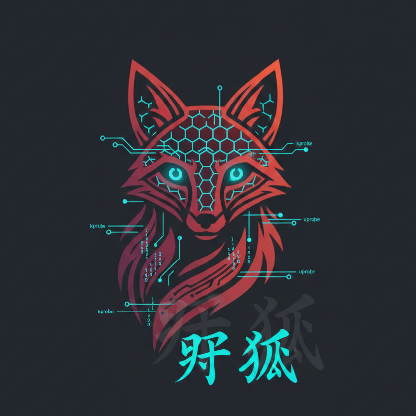

<p align="center">
  
</p>

<h1 align="center">野狐 Nogitsune</h1>

<p align="center">
  <b>eBPF-based anti-sandbox toolkit for Linux</b>
</p>

<p align="center">
  <a href="#installation"></a>
  <a href="LICENSE"></a>
  <a href="#"></a>
</p>

<p align="center">
  <i>Make your VirtualBox VM appear as bare-metal Dell hardware.</i>
</p>

---

## What is Nogitsune?

Nogitsune spoofs hardware identifiers at the kernel level using eBPF, defeating malware anti-VM detection at runtime.

Unlike hypervisor patches that require QEMU recompilation, Nogitsune works instantly on any stock Linux kernel 5.8+.

```bash
# Before: Malware detects VirtualBox and refuses to run
$ cat /sys/class/dmi/id/sys_vendor
innotek GmbH

# After: Malware sees Dell hardware and executes
$ sudo ./nogitsune spoof --stealth
$ cat /sys/class/dmi/id/sys_vendor
Dell Inc.
```

---

## Quick Start

```bash
# Clone with submodules
git clone --recursive https://github.com/sumukhchitloor/nogitsune
cd nogitsune/src

# Build
make

# Run all spoofers with process hiding
sudo ./nogitsune spoof --stealth

# Check what would be spoofed (dry run)
./nogitsune check

# Hide analysis tools from malware
sudo ./nogitsune hide --name wireshark,tcpdump,strace
```

---

## Detection Coverage

| Detection Technique | Target | Status |
|---------------------|--------|--------|
| DMI/SMBIOS strings | `/sys/class/dmi/id/*` | Spoofed (10 files) |
| MAC address (file) | `/sys/class/net/*/address` | Spoofed |
| MAC address (ioctl) | `SIOCGIFHWADDR` | Spoofed |
| MAC address (netlink) | `RTM_GETLINK` | Spoofed |
| CPU flags | `/proc/cpuinfo` | Spoofed (hypervisor removed) |
| Memory size | `/proc/meminfo` | Spoofed (2GB to 16GB) |
| Disk model/serial | `/sys/class/block/*/device/*` | Spoofed |
| PCI vendor IDs | `/sys/bus/pci/devices/*/vendor` | Spoofed |
| Process enumeration | `getdents64` on `/proc` | Hidden |
| Kernel modules | `/proc/modules` | Hidden |
| CPUID instruction | Hardware | Not possible with eBPF |
| RDTSC timing | Hardware | Not possible with eBPF |

### Spoofed Profile: Dell OptiPlex 7090

| Field | VirtualBox | Spoofed Value |
|-------|------------|---------------|
| `sys_vendor` | innotek GmbH | Dell Inc. |
| `product_name` | VirtualBox | OptiPlex 7090 |
| `bios_vendor` | innotek GmbH | Dell Inc. |
| `board_vendor` | Oracle Corporation | Dell Inc. |
| `board_name` | VirtualBox | 0WN7Y6 |
| `chassis_vendor` | Oracle Corporation | Dell Inc. |
| MAC prefix | 08:00:27 | a4:5e:60 |
| Disk model | VBOX HARDDISK | Samsung SSD 970 EVO Plus |
| MemTotal | 2 GB | 16 GB |
| CPU cores | 2 | 8 |

---

## Installation

### Prerequisites

```bash
# Ubuntu/Debian
sudo apt install clang llvm libelf-dev zlib1g-dev make git

# Fedora
sudo dnf install clang llvm elfutils-libelf-devel zlib-devel make git

# Arch
sudo pacman -S clang llvm libelf zlib make git
```

### Build

```bash
git clone --recursive https://github.com/sumukhchitloor/nogitsune
cd nogitsune/src
make
```

### Verify Kernel Support

```bash
# Need kernel 5.8+ with BTF
uname -r
ls /sys/kernel/btf/vmlinux
```

---

## Usage

### Commands

```bash
# Load all spoofers
sudo ./nogitsune spoof

# Load all spoofers + hide them from ps/top
sudo ./nogitsune spoof --stealth

# Load specific spoofers only
sudo ./nogitsune spoof --dmi --mac --cpu

# Dry run - show what would be changed
./nogitsune check

# Scan system for VM indicators
sudo ./nogitsune status

# Stop all spoofers
sudo ./nogitsune stop
```

### Spoof Options

```
--all        Load all spoofers (default)
--dmi        DMI/SMBIOS files
--mac        MAC address (all three methods)
--cpu        /proc/cpuinfo
--mem        /proc/meminfo
--pci        PCI device vendor IDs
--disk       Disk model and serial
--modules    Hide vbox kernel modules
--stealth    Hide spoofer processes from /proc
```

### Process Hiding

```bash
# Hide by PID
sudo ./nogitsune hide --pid 1234,5678

# Hide by process name
sudo ./nogitsune hide --name wireshark,tcpdump,strace,gdb

# Hide self
sudo ./nogitsune hide --self
```

### Individual Tools

Each spoofer can run standalone:

```bash
sudo ./dmi_spoof          # DMI/SMBIOS
sudo ./cpuinfo_spoof      # /proc/cpuinfo
sudo ./meminfo_spoof      # /proc/meminfo
sudo ./ioctl_spoof        # MAC via ioctl
sudo ./netlink_spoof      # MAC via netlink
sudo ./pci_spoof          # PCI vendor IDs
sudo ./pidhide -n sshd    # Hide processes by name
sudo ./pidhide -p 1234    # Hide processes by PID
```

---

## Architecture

```
┌────────────────────────────────────────────────────────────────────────────┐
│                              USER SPACE                                    │
│                                                                            │
│   ┌──────────────┐                      ┌────────────────────────────────┐ │
│   │              │   read("/sys/...")   │                                │ │
│   │   Malware    │──────────────────────│         nogitsune CLI          │ │
│   │              │   getdents64("/proc")│                                │ │
│   │  (victim)    │◄─────────────────────│   Orchestrates all spoofers    │ │
│   │              │   spoofed response   │   Manages process hiding       │ │
│   └──────────────┘                      └────────────────────────────────┘ │
│                                                       │                    │
│         ▲ Sees spoofed data                          │ loads               │
│         │                                             ▼                    │
├─────────┼──────────────────────────────────────────────────────────────────┤
│         │                      KERNEL SPACE                                │
│         │                                                                  │
│   ┌─────┴──────────────────────────────────────────────────────────────┐   │
│   │                         eBPF PROGRAMS                              │   │
│   │                                                                    │   │
│   │  ┌─────────────────────────────────────────────────────────────┐   │   │
│   │  │ tracepoint/syscalls/sys_exit_read                           │   │   │
│   │  │                                                             │   │   │
│   │  │  ┌────────────┐ ┌────────────┐ ┌────────────┐ ┌──────────┐  │   │   │
│   │  │  │ dmi_spoof  │ │  cpuinfo   │ │  meminfo   │ │pci_spoof │  │   │   │
│   │  │  │            │ │  _spoof    │ │  _spoof    │ │          │  │   │   │
│   │  │  │ 10 DMI     │ │ hypervisor │ │ MemTotal   │ │ vendor   │  │   │   │
│   │  │  │ files      │ │ flag+cores │ │ 16GB       │ │ IDs      │  │   │   │
│   │  │  └────────────┘ └────────────┘ └────────────┘ └──────────┘  │   │   │
│   │  │                                                             │   │   │
│   │  │  ┌────────────┐ ┌────────────┐ ┌────────────┐               │   │   │
│   │  │  │   ioctl    │ │  netlink   │ │ textreplace│               │   │   │
│   │  │  │  _spoof    │ │  _spoof    │ │ (mac file) │               │   │   │
│   │  │  │            │ │            │ │            │               │   │   │
│   │  │  │ MAC ioctl  │ │ MAC rtnetl │ │ /sys/net/* │               │   │   │
│   │  │  └────────────┘ └────────────┘ └────────────┘               │   │   │
│   │  └─────────────────────────────────────────────────────────────┘   │   │
│   │                                                                    │   │
│   │  ┌─────────────────────────────────────────────────────────────┐   │   │
│   │  │ tracepoint/syscalls/sys_exit_getdents64                     │   │   │
│   │  │                                                             │   │   │
│   │  │  ┌────────────────────────────────────────────────────────┐ │   │   │
│   │  │  │                      pidhide                           │ │   │   │
│   │  │  │                                                        │ │   │   │
│   │  │  │  Intercepts directory listing of /proc                 │ │   │   │
│   │  │  │  Removes entries for hidden PIDs                       │ │   │   │
│   │  │  │  Malware running "ps aux" won't see hidden processes   │ │   │   │
│   │  │  └────────────────────────────────────────────────────────┘ │   │   │
│   │  └─────────────────────────────────────────────────────────────┘   │   │
│   │                                                                    │   │
│   │  Method: bpf_probe_write_user() modifies buffer after kernel       │   │
│   │          fills it but before data returns to userspace             │   │
│   └────────────────────────────────────────────────────────────────────┘   │
│                                                                            │
│   Target Files:                                                            │
│   /sys/class/dmi/id/*           /sys/class/net/*/address                   │
│   /proc/cpuinfo                 /proc/meminfo                              │
│   /sys/bus/pci/devices/*/vendor /sys/class/block/*/device/model            │
└────────────────────────────────────────────────────────────────────────────┘
```

### How It Works

1. **Hook Point**: eBPF programs attach to `tracepoint/syscalls/sys_exit_read`
2. **Timing**: Hooks fire *after* the kernel fills the read buffer but *before* returning to userspace
3. **File Tracking**: `sys_enter_read` tracks which file descriptor maps to which path
4. **Modification**: `bpf_probe_write_user()` overwrites buffer contents with spoofed values
5. **Process Hiding**: `pidhide` hooks `getdents64` and removes directory entries from `/proc`

The original files on disk are never modified. Spoofing happens entirely in memory during the syscall.

### Why eBPF?

| Approach | Requires | Deployment | Detectability |
|----------|----------|------------|---------------|
| QEMU patches | Source recompilation | Complex | Low |
| Kernel module | Custom kernel build | Medium | Medium |
| eBPF | Stock kernel 5.8+ | Instant | Low |


---

## Limitations

eBPF operates at the syscall level. It cannot intercept:

- **CPUID instructions** - Executed directly by CPU, no syscall involved
- **RDTSC timing attacks** - Hardware instruction, cannot be hooked
- **MSR reads** - Requires hypervisor-level interception
- **Hardware enumeration** - Direct port I/O

For complete transparency against sophisticated malware, combine Nogitsune with:
- KVM `hidden state` configuration
- QEMU anti-detection patches
- Custom SMBIOS in libvirt XML

---

## Credits

- [bad-bpf](https://github.com/pathtofile/bad-bpf) - Foundation and eBPF techniques
- [libbpf](https://github.com/libbpf/libbpf) - eBPF library
- [VMAware](https://github.com/kernelwernel/VMAware) - VM detection testing

---

## Disclaimer

This tool is for authorized security research only:

- Malware analysis in controlled lab environments
- Security testing with proper authorization  
- Educational purposes

Not for evading detection on systems you don't own.

---

## License

BSD 3-Clause License - See [LICENSE](LICENSE) for details.

---

<p align="center">
  <b>野狐 Nogitsune</b> - The wild fox that tricks malware
</p>
