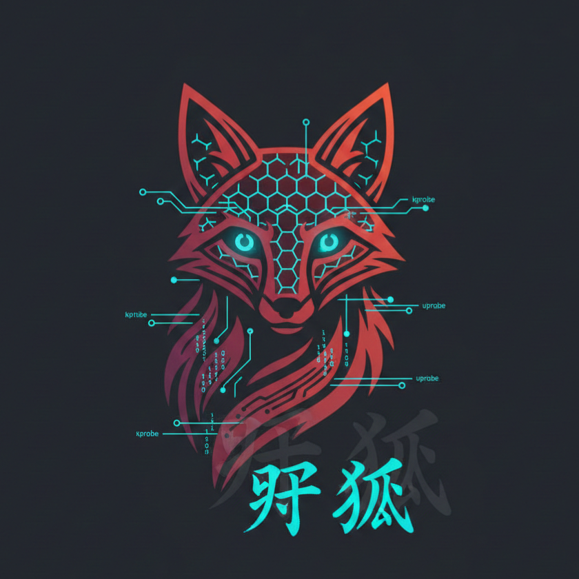

<p align="center">
  
</p>

<h1 align="center">野狐 Nogitsune</h1>

<p align="center">
  <b>eBPF-based anti-sandbox toolkit for Linux</b>
</p>

<p align="center">
  <a href="#installation"></a>
  <a href="LICENSE"></a>
  <a href="#"></a>
</p>

<p align="center">
  <i>Make your VirtualBox VM appear as bare-metal Dell hardware.</i>
</p>

---

## What is Nogitsune?

Nogitsune spoofs hardware identifiers at the kernel level using eBPF, defeating malware anti-VM detection at runtime.

Unlike hypervisor patches that require QEMU recompilation, Nogitsune works instantly on any stock Linux kernel 5.8+.

```bash
# Before: Malware detects VirtualBox and refuses to run
$ cat /sys/class/dmi/id/sys_vendor
innotek GmbH

# After: Malware sees Dell hardware and executes
$ sudo ./nogitsune spoof --stealth
$ cat /sys/class/dmi/id/sys_vendor
Dell Inc.
```

### Architecture Support

**x86_64 works exactly as it always has** - `dmi_spoof` and `cpuinfo_spoof` both run
normally, since real DMI/SMBIOS and the x86 `hypervisor` CPUID-derived `/proc/cpuinfo`
field both exist there. ARM64 support is purely additive on top of that, not a
replacement path:

| | x86_64 | ARM64 (UEFI-booted, has DMI) | ARM64 (Device Tree boot, no DMI) |
|---|---|---|---|
| Hardware identity | `dmi_spoof` | `dmi_spoof` | `devicetree_spoof` |
| `/proc/cpuinfo` | `cpuinfo_spoof` runs | `cpuinfo_spoof` runs | skipped (no `hypervisor` field on ARM64) |
| MAC / disk / PCI / modules / pidhide | all run, identical on every architecture | | |

`nogitsune` decides DMI vs. Device Tree by checking which path actually exists on the
host (`/sys/class/dmi/id/sys_vendor` vs `/proc/device-tree/*`) - never by checking
`uname -m` - so a UEFI-booted ARM64 VM is treated exactly like an x86 one. Run
`nogitsune check` or `status` to see which mode it picked on your system.

---

## Quick Start

```bash
# Clone with submodules
git clone --recursive https://github.com/sumukhchitloor/nogitsune
cd nogitsune/src

# Build
make

# Run all spoofers with process hiding
sudo ./nogitsune spoof --stealth

# Check what would be spoofed (dry run)
./nogitsune check

# Hide analysis tools from malware
sudo ./nogitsune hide --name wireshark,tcpdump,strace
```

---

## Detection Coverage

| Detection Technique | Target | Status |
|---------------------|--------|--------|
| DMI/SMBIOS strings | `/sys/class/dmi/id/*` | Spoofed (12 files, runtime-configurable) |
| Raw SMBIOS table (`dmidecode` bypass) | `/sys/firmware/dmi/tables/DMI` | Spoofed |
| Device Tree identity (ARM64, no DMI) | `/proc/device-tree/{model,compatible}` | Spoofed |
| MAC address (file) | `/sys/class/net/*/address` | Spoofed |
| MAC address (ioctl) | `SIOCGIFHWADDR` | Spoofed |
| MAC address (netlink) | `RTM_GETLINK` | Spoofed |
| CPU flags | `/proc/cpuinfo` | Spoofed (hypervisor removed) - x86 only, skipped on ARM64 |
| CPU count (`nproc`) | `sched_getaffinity()` | Spoofed (configurable) |
| Memory size | `/proc/meminfo` | Spoofed (configurable, default 2GB to 16GB) |
| Uptime ("suspiciously fresh boot") | `/proc/uptime` | Spoofed (configurable) |
| Disk model | `/sys/class/block/*/device/model` | Spoofed |
| PCI vendor IDs | `/sys/bus/pci/devices/*/vendor` | Spoofed |
| Process enumeration | `getdents64` on `/proc` | Hidden |
| Guest Additions process names (`VBoxService`, etc.) | `ps`/`/proc` | Hidden (auto, in `--stealth`) |
| Guest Additions files (directory listing) | `ls`/`find` on `/opt`, kernel module dirs, etc. | Hidden |
| Guest Additions files (direct probe) | `open()`/`stat()`/`access()` on known paths | Denied (BPF LSM) |
| Kernel modules | `/proc/modules` | Hidden |
| Live kernel log | `/dev/kmsg`, legacy `syslog()` | Sanitized (live reads only - see Known Limitations) |
| CPUID instruction | Hardware | Not possible with eBPF |
| RDTSC timing | Hardware | Not possible with eBPF |

### Spoofed Profile: Dell OptiPlex 7090 (default, fully configurable)

The values below are the built-in defaults used when no `--config` file is given. Every
value is runtime-configurable via a JSON profile (see [Custom Profiles](#custom-profiles)) -
nothing below requires recompiling.

| Field | VirtualBox | Spoofed Value |
|-------|------------|---------------|
| `sys_vendor` | innotek GmbH | Dell Inc. |
| `product_name` | VirtualBox | OptiPlex 7090 |
| `bios_vendor` | innotek GmbH | Dell Inc. |
| `board_vendor` | Oracle Corporation | Dell Inc. |
| `board_name` | VirtualBox | 0K240Y |
| `chassis_vendor` | Oracle Corporation | Dell Inc. |
| MAC prefix | 08:00:27 | a4:5e:60 |
| Disk model | VBOX HARDDISK | Samsung SSD 970 |
| MemTotal | 2 GB | 16 GB |
| CPU cores | 2 | 8 |

On ARM64 hosts with no `/sys/class/dmi/id` (plain Device Tree boot - Raspberry Pi, bare QEMU
`virt`), `nogitsune` automatically uses `devicetree_spoof` instead of `dmi_spoof`, spoofing
`/proc/device-tree/model` and `/proc/device-tree/compatible` to "Dell Inc. OptiPlex 7090" /
"dell,optiplex-7090" by default. ARM64 VMs booted via UEFI firmware still have DMI and use
`dmi_spoof` as normal - the choice is based on which path exists, not on CPU architecture.

---

## Installation

### Prerequisites

```bash
# Ubuntu/Debian
sudo apt install clang llvm libelf-dev zlib1g-dev make git

# Fedora
sudo dnf install clang llvm elfutils-libelf-devel zlib-devel make git

# Arch
sudo pacman -S clang llvm libelf zlib make git
```

### Build

```bash
git clone --recursive https://github.com/sumukhchitloor/nogitsune
cd nogitsune/src
make
```

### Verify Kernel Support

```bash
# Need kernel 5.8+ with BTF
uname -r
ls /sys/kernel/btf/vmlinux
```

---

## Usage

Every command supports `--help` for its full, specific option list (no root needed even
for commands that otherwise require it, e.g. `nogitsune spoof --help`). The top-level
`nogitsune --help` is a quick-start overview; this section and
[docs/CONFIGURATION.md](docs/CONFIGURATION.md) are the deeper reference.

### Commands

```bash
# Generate a starter profile you can edit (no root needed)
./nogitsune init-config my-profile.json

# Dry run - show what would be changed (no root needed)
./nogitsune check
./nogitsune check -c my-profile.json

# Load all spoofers
sudo ./nogitsune spoof

# Load all spoofers + hide them from ps/top
sudo ./nogitsune spoof --stealth

# Load specific spoofers only
sudo ./nogitsune spoof --dmi --mac --cpu

# Run detached, so closing this shell doesn't stop it
sudo ./nogitsune spoof --stealth --background

# Scan system for VM indicators + show whether a session is active
sudo ./nogitsune status

# Stop the running session (works from any terminal, foreground or background)
sudo ./nogitsune stop
```

### Spoof Options

```
--all              Load all spoofers (default)
--dmi              Hardware identity (DMI, or Device Tree on ARM64 without DMI)
--mac              MAC address (all three methods)
--cpu              /proc/cpuinfo (skipped automatically on ARM64)
--mem              /proc/meminfo
--pci              PCI device vendor IDs
--disk             Disk model
--modules          Hide vbox kernel modules
--artifacts        Guest Additions artifact hiding (directory-listing + direct-path)
--uptime           /proc/uptime
--cpucount         sched_getaffinity CPU count (what `nproc` checks by default)
--kmsg             Live kernel-log sanitization (/dev/kmsg, legacy syslog())
-c, --config PATH  Load a custom JSON hardware profile
-d, --background   Detach and keep running after this shell exits
--stealth          Hide spoofer processes from /proc
```

Only one `spoof` session can run at a time - it refuses to start a second one if
`status` shows one already active; run `stop` first.

### Background Mode

`spoof --background` (alias `-d`/`--daemon`) double-detaches the process (`setsid` +
redirected stdio) so it survives the shell or SSH session that started it being closed.
Output goes to `/var/log/nogitsune.log` instead of the terminal. The session is tracked
via `/run/nogitsune.pid`, which is what makes `nogitsune stop` work from a completely
different terminal than the one that ran `spoof` - it signals that PID, whose own cleanup
handler stops every spoofer (and `pidhide`, if `--stealth` was used) before exiting.

```bash
sudo ./nogitsune spoof --stealth --background
# ... shell/SSH session can now close safely ...
sudo ./nogitsune status   # shows "Session: active (PID ...)" from any terminal
sudo ./nogitsune stop
```

### Custom Profiles

By default `nogitsune` uses the built-in Dell OptiPlex 7090 profile shown above. Pass
`-c`/`--config` with a JSON file to override any subset of it - keys you omit keep their
default value. The fastest way to start one:

```bash
./nogitsune init-config my-profile.json   # writes every field at its current default
./nogitsune check -c my-profile.json      # preview before applying
sudo ./nogitsune spoof -c my-profile.json
```

Example of a partial override (only the listed keys change, everything else keeps its
default):

```json
{
  "dmi": { "sys_vendor": "Lenovo", "product_name": "ThinkCentre M90q" },
  "mac": "00:1a:2b:3c:4d:5e",
  "memory": { "total_kb": 8192000 },
  "disk": { "model": "WD Blue SN570" },
  "cpu": { "cores": 4, "keep_hypervisor_flag": false },
  "pci": [{ "from": "0x80ee", "to": "0x8086" }],
  "modules_to_hide": ["vboxguest", "vboxsf", "vboxvideo"],
  "hidden_files": ["VBoxGuestAdditions", "VBoxService"],
  "hidden_paths": ["/usr/sbin/VBoxService"],
  "uptime_seconds": 604800,
  "fake_cpu_count": 8
}
```

See **[docs/CONFIGURATION.md](docs/CONFIGURATION.md)** for the full field-by-field
reference (types, defaults, validation rules, which spoofer each key maps to).

### Process Hiding

```bash
# Hide by PID
sudo ./nogitsune hide --pid 1234,5678

# Hide by process name
sudo ./nogitsune hide --name wireshark,tcpdump,strace,gdb

# Hide self
sudo ./nogitsune hide --self
```

### Individual Tools

Each spoofer can run standalone:

```bash
sudo ./dmi_spoof          # DMI/SMBIOS (now also covers the raw SMBIOS table dmidecode reads)
sudo ./devicetree_spoof   # ARM64 Device Tree (model, compatible) - no DMI needed
sudo ./cpuinfo_spoof      # /proc/cpuinfo
sudo ./meminfo_spoof      # /proc/meminfo
sudo ./uptime_spoof       # /proc/uptime
sudo ./cpucount_spoof     # sched_getaffinity CPU count
sudo ./ioctl_spoof        # MAC via ioctl
sudo ./netlink_spoof      # MAC via netlink
sudo ./pci_spoof          # PCI vendor IDs
sudo ./modules_hide       # Hide kernel modules from /proc/modules
sudo ./fshide --name VBoxGuestAdditions   # Hide directory entries by filename prefix
sudo ./pathdeny --path /usr/sbin/VBoxService   # Deny open/stat/access on exact paths
sudo ./kmsg_spoof         # Live kernel-log sanitization (no flags - patterns are fixed)
sudo ./pidhide -n sshd    # Hide processes by name (re-resolves periodically, survives respawns)
sudo ./pidhide -p 1234    # Hide processes by PID
```

Each tool also takes its own flags for the value(s) it spoofs (e.g. `./dmi_spoof --sys-vendor
"Lenovo" --product-name "ThinkCentre M90q"`, `./meminfo_spoof --mem-total-kb 8192000`) - run
any of them with `--help` for the full list. Running with no flags uses the same Dell
defaults shown above.

---

## Architecture

```
┌────────────────────────────────────────────────────────────────────────────┐
│                              USER SPACE                                    │
│                                                                            │
│   ┌──────────────┐                      ┌────────────────────────────────┐ │
│   │              │   read("/sys/...")   │                                │ │
│   │   Malware    │──────────────────────│         nogitsune CLI          │ │
│   │              │   getdents64("/proc")│                                │ │
│   │  (victim)    │◄─────────────────────│   Orchestrates all spoofers    │ │
│   │              │   spoofed response   │   Manages process hiding       │ │
│   └──────────────┘                      └────────────────────────────────┘ │
│                                                       │                    │
│         ▲ Sees spoofed data                          │ loads               │
│         │                                             ▼                    │
├─────────┼──────────────────────────────────────────────────────────────────┤
│         │                      KERNEL SPACE                                │
│         │                                                                  │
│   ┌─────┴──────────────────────────────────────────────────────────────┐   │
│   │                         eBPF PROGRAMS                              │   │
│   │                                                                    │   │
│   │  ┌─────────────────────────────────────────────────────────────┐   │   │
│   │  │ tracepoint/syscalls/sys_exit_read                           │   │   │
│   │  │                                                             │   │   │
│   │  │  ┌────────────┐ ┌────────────┐ ┌────────────┐ ┌──────────┐  │   │   │
│   │  │  │ dmi_spoof  │ │  cpuinfo   │ │  meminfo   │ │pci_spoof │  │   │   │
│   │  │  │ (or device-│ │  _spoof    │ │  _spoof    │ │          │  │   │   │
│   │  │  │ tree_spoof)│ │ hypervisor │ │ MemTotal   │ │ vendor   │  │   │   │
│   │  │  │ 12 DMI     │ │ flag+cores │ │ (config-   │ │ IDs      │  │   │   │
│   │  │  │ files      │ │ (x86 only) │ │ urable)    │ │          │  │   │   │
│   │  │  └────────────┘ └────────────┘ └────────────┘ └──────────┘  │   │   │
│   │  │                                                             │   │   │
│   │  │  ┌────────────┐ ┌────────────┐ ┌────────────┐               │   │   │
│   │  │  │   ioctl    │ │  netlink   │ │ textreplace│               │   │   │
│   │  │  │  _spoof    │ │  _spoof    │ │ (mac file) │               │   │   │
│   │  │  │            │ │            │ │            │               │   │   │
│   │  │  │ MAC ioctl  │ │ MAC rtnetl │ │ /sys/net/* │               │   │   │
│   │  │  └────────────┘ └────────────┘ └────────────┘               │   │   │
│   │  └─────────────────────────────────────────────────────────────┘   │   │
│   │                                                                    │   │
│   │  ┌─────────────────────────────────────────────────────────────┐   │   │
│   │  │ tracepoint/syscalls/sys_exit_getdents64                     │   │   │
│   │  │                                                             │   │   │
│   │  │  ┌────────────────────────────────────────────────────────┐ │   │   │
│   │  │  │                      pidhide                           │ │   │   │
│   │  │  │                                                        │ │   │   │
│   │  │  │  Intercepts directory listing of /proc                 │ │   │   │
│   │  │  │  Removes entries for hidden PIDs                       │ │   │   │
│   │  │  │  Malware running "ps aux" won't see hidden processes   │ │   │   │
│   │  │  └────────────────────────────────────────────────────────┘ │   │   │
│   │  └─────────────────────────────────────────────────────────────┘   │   │
│   │                                                                    │   │
│   │  Method: bpf_probe_write_user() modifies buffer after kernel       │   │
│   │          fills it but before data returns to userspace             │   │
│   └────────────────────────────────────────────────────────────────────┘   │
│                                                                            │
│   Target Files:                                                            │
│   /sys/class/dmi/id/*           /sys/class/net/*/address                   │
│   /proc/cpuinfo                 /proc/meminfo                              │
│   /sys/bus/pci/devices/*/vendor /sys/class/block/*/device/model            │
└────────────────────────────────────────────────────────────────────────────┘
```

### How It Works

1. **Hook Point**: eBPF programs attach to `tracepoint/syscalls/sys_exit_read`
2. **Timing**: Hooks fire *after* the kernel fills the read buffer but *before* returning to userspace
3. **File Tracking**: `sys_enter_read` tracks which file descriptor maps to which path
4. **Modification**: `bpf_probe_write_user()` overwrites buffer contents with spoofed values
5. **Process Hiding**: `pidhide` hooks `getdents64` and removes directory entries from `/proc`

The original files on disk are never modified. Spoofing happens entirely in memory during the syscall.

### Why eBPF?

| Approach | Requires | Deployment | Detectability |
|----------|----------|------------|---------------|
| QEMU patches | Source recompilation | Complex | Low |
| Kernel module | Custom kernel build | Medium | Medium |
| eBPF | Stock kernel 5.8+ | Instant | Low |


---

## Limitations

eBPF operates at the syscall level. It cannot intercept:

- **CPUID instructions** - Executed directly by CPU, no syscall involved
- **RDTSC timing attacks** - Hardware instruction, cannot be hooked
- **MSR reads** - Requires hypervisor-level interception
- **Hardware enumeration** - Direct port I/O

For complete transparency against sophisticated malware, combine Nogitsune with:
- KVM `hidden state` configuration
- QEMU anti-detection patches
- Custom SMBIOS in libvirt XML

### Known Limitations

A few deliberate simplifications, documented here rather than silently presented as solved:

- **Disk auto-detection is a heuristic, not real root-filesystem resolution.** `nogitsune`
  picks the lexicographically-first `/sys/block` entry that has a `device/model` file (so
  `sda` before `sdb`). This is wrong on systems where a secondary/data drive enumerates
  before the boot drive.
- **Network interface auto-detection falls back to lexicographic order if nothing is
  observed `up`** at detection time (e.g. spoofing launched before a NIC comes up at boot).
  The pick is unconfirmed in that case and a warning is printed.
- **`/proc/device-tree/compatible` is treated as a single value**, not the real
  NUL-separated list of compatible strings Device Tree actually uses. Adequate to defeat
  naive string checks, not byte-accurate.
- **`cpuinfo_spoof` only replaces a single ASCII digit** for `cpu cores`/`siblings` counts -
  multi-digit core counts (10+) aren't supported.
- **DMI `modalias`/`uevent` substring rewriting is fixed, not configurable** - those are
  exact-byte-length embedded substring swaps (`innotekGmbH`/`VirtualBox`/`OracleCorporation`/
  `VBOX`), independent of the 12 configurable per-file DMI values.
- **`kmsg_spoof` only sanitizes live reads of the kernel ring buffer** - it does not
  retroactively scrub boot-time `VBoxGuest`/`VBoxService` messages systemd already archived
  into the journal before `kmsg_spoof` started. Mitigation is rotating/vacuuming the
  journal as a pre-analysis setup step (`journalctl --rotate && journalctl
  --vacuum-time=1s`), not something this tool attempts (deleting/rewriting systemd's
  actively-written binary journal files is outside its scope).
- **`pathdeny`'s `access()` coverage only applies to paths that already existed when it
  started** - it resolves each path's `(device, inode)` once at startup, since the kernel
  hook for `access()` has no path string available at all (confirmed by direct kernel BTF
  inspection, not assumed). `open()`/`stat()` coverage is unaffected by this and works
  dynamically regardless of when a path appears. `pathdeny` itself needs `CONFIG_BPF_LSM`
  + `bpf` active in `/sys/kernel/security/lsm` - if unavailable, it exits cleanly without
  affecting any other spoofer.
- **`cpucount_spoof` only covers `sched_getaffinity()`** (what `nproc`'s default behavior
  checks) - `/sys/devices/system/cpu/*` and `/proc/cpuinfo`'s processor-line count (what
  `nproc --all` uses, and the only thing ARM64 even has) are separate, unaddressed code
  paths, confirmed independent by code inspection.
- **`fshide` only defeats enumeration** (`ls`/`find`/`readdir`) - a caller that already
  knows an exact path bypasses it by opening/stating the path directly without listing its
  parent directory. `pathdeny` closes that specific gap for the paths you configure there.

---

## Credits

- [bad-bpf](https://github.com/pathtofile/bad-bpf) - Foundation and eBPF techniques
- [libbpf](https://github.com/libbpf/libbpf) - eBPF library
- [VMAware](https://github.com/kernelwernel/VMAware) - VM detection testing

---

## Disclaimer

This tool is for authorized security research only:

- Malware analysis in controlled lab environments
- Security testing with proper authorization  
- Educational purposes

Not for evading detection on systems you don't own.

---

## License

BSD 3-Clause License - See [LICENSE](LICENSE) for details.

---

<p align="center">
  <b>野狐 Nogitsune</b> - The wild fox that tricks malware
</p>
